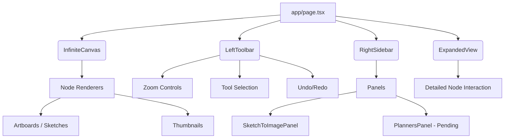

# CAI-CANVAS

**CAI-CANVAS**는 7-노드 AI 건축 설계 파이프라인의 메인 프론트엔드 워크벤치입니다. 이 프로젝트는 무한 캔버스 환경에서 건축 분석, 생성 및 통합 시각화를 제공하며, 가볍고 직관적인 노드 기반 인터페이스를 통해 사용자의 작업 효율을 극대화합니다.

---

## 🛠 기술 스택

- **Core:** Next.js 15, React 19
- **Styling:** Tailwind CSS v4, PostCSS
- **State Management:** React 내장 Hooks (`useState`, `useCallback`) 및 `localStorage` 기반 경량화 상태 유지
- **Dependencies:** `@google/generative-ai`, `localforage`

---

## 🗺 애플리케이션 구조도

CAI-CANVAS는 뷰포트 영역 전체를 무한 캔버스로 활용하며, 상태(View, Nodes)는 `localStorage`에 자동 저장(Persist)됩니다.

### 주요 컴포넌트 역할
- **`InfiniteCanvas`**: 무한 스크롤 및 줌인/아웃이 가능한 캔버스 코어 영역. 노드들의 좌표와 관계를 렌더링합니다.
- **`LeftToolbar`**: 커서/핸들 툴 전환, 줌 제어, 신규 아트보드 생성 등의 글로벌 캔버스 액션을 담당합니다.
- **`RightSidebar`**: 선택된 노드에 따른 문맥 기반의 속성 및 조작 패널을 제공합니다.
- **`ExpandedView`**: 특정 아트보드나 노드를 화면 전체 혹은 크게 포커스하여 상세 작업을 수행하는 뷰입니다.

---

## 🚀 향후 작업 계획: N01.Planners 통합

현재 CAI-CANVAS의 핵심 과제는 기존 **`N01.Planners`** 앱의 고도화된 UI 컴포넌트를 이 캔버스 환경으로 완벽하게 연동 및 마이그레이션하는 것입니다. 

### 통합 전략 (UX Parity Migration)
1. **역할 분리 (Frontend / Backend API)**
   - `N01.Planners`는 완전히 **백엔드 API Provider** 역할만 수행하도록 전환합니다.
   - `project_canvas`는 상태 관리를 무겁게 가져가지 않고(Zustand 등 배제), 가볍고 퍼포먼스 높은 순수 UI/UX 레이어 역할에 집중합니다.

2. **완벽한 UI 이식 (100% UX Parity)**
   - 기존 `N01.Planners` (`RightPanel.tsx`)에서 구현된 완벽한 마크다운(Markdown) 렌더링, 전문가 버블(Expert bubbles), 인용 마커(Citation markers) 등의 고급 UI 컴포넌트들을 `project_canvas`의 `components/panels/PlannersPanel.tsx`로 이식합니다.

3. **고급 기능 통합**
   - 병렬 AI 응답 선택 기능.
   - 멀티턴(Multi-turn) 대화 기록 및 Undo 플로우 최적화 유지.

이를 통해 CAI-CANVAS는 시각적인 디자인 타겟뿐만 아니라 설계 플래너로서의 강력한 AI 대화형 엔진까지 포함한 진정한 "BIM Workbench"로 진화할 예정입니다.
